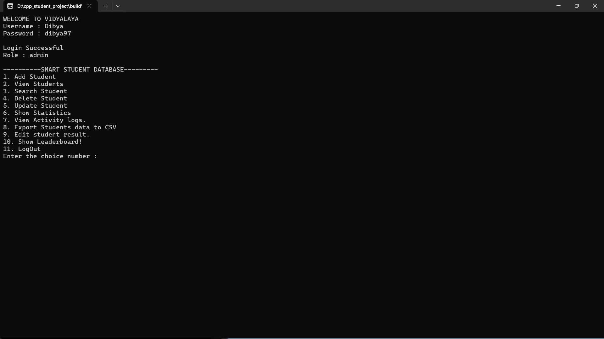
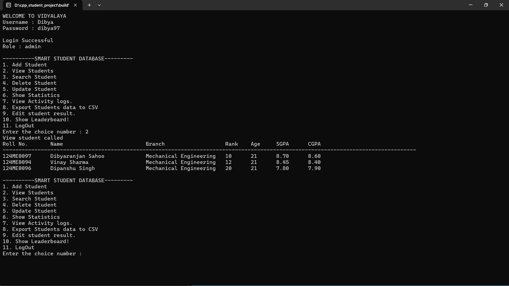
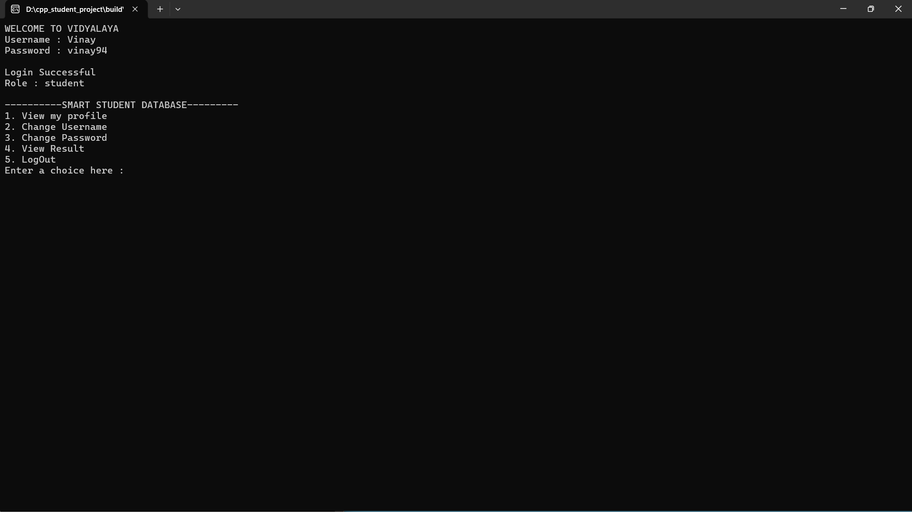
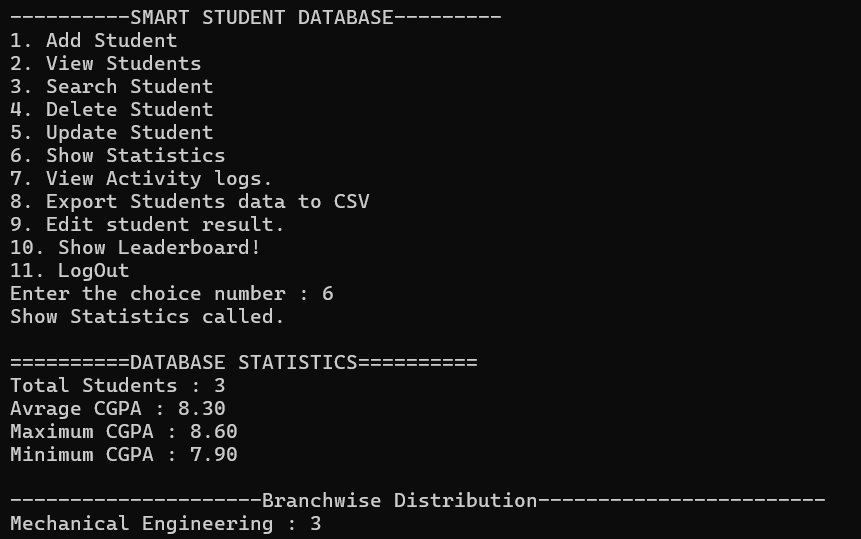
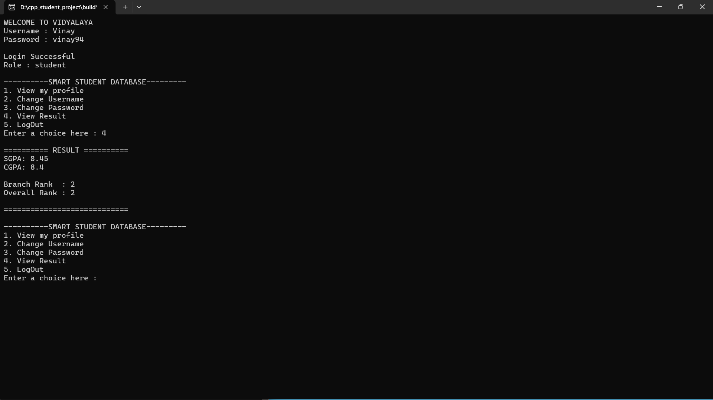
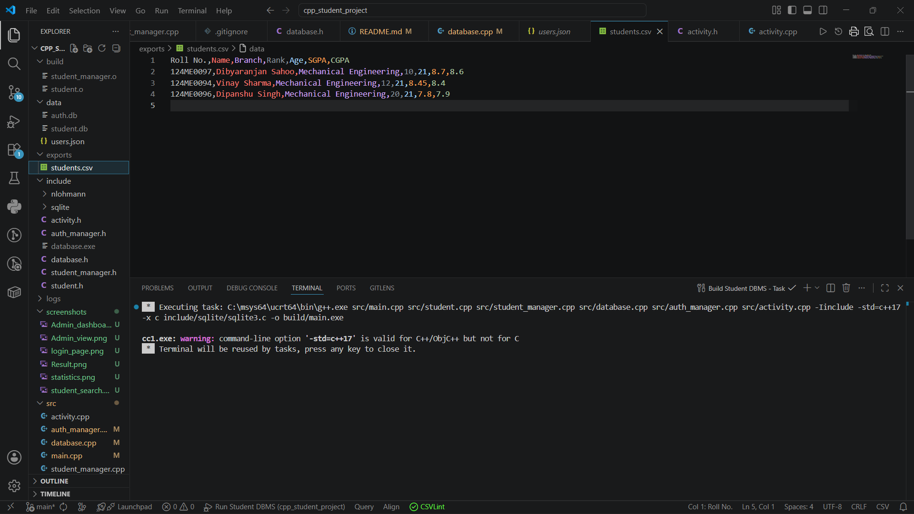

# Vidyalaya - Student Database Management System

A role-based Student Database Management System built in C++ with SQLite for persistent storage. The system supports authentication, authorization, student record management, caching, activity logging, ranking analytics, and CSV export.


## Highlights

* Developed a role-based Student Database Management System using C++17 and SQLite.
* Implemented secure authentication with password hashing and role-based access control.
* Integrated SQLite databases with prepared statements for efficient and secure data storage.
* Optimized student lookups using in-memory hash-map-based caching.
* Added activity logging, analytics, rankings, leaderboard generation, and CSV export.
* Designed the application using Object-Oriented Programming principles and modular architecture.


## Features

### Authentication & Authorization

* Multi-role login system

  * Admin
  * Teacher
  * Student
* Secure student authentication
* Password hashing
* Username and password management
* Role-based access control


### Student Management

* Add new students
* Search students by Roll Number
* Search students by Name
* Update student records
* Delete student records
* View student profiles
* View academic results


### Database & Storage

* SQLite-based persistent storage
* Prepared SQL statements
* Indexed student records
* JSON-based admin and teacher configuration


### Performance Optimization

* In-memory student cache
* Authentication cache
* Fast O(1) average student lookup using hash maps


### Analytics & Reporting

* Branch-wise statistics
* Overall database statistics
* Student ranking system
* Leaderboard generation
* CSV export functionality


### Logging

* Administrative activity logging
* Audit trail for student management operations


## Technologies Used

* C++17
* SQLite3
* nlohmann/json
* STL
* Object-Oriented Programming (OOP)
* SQL
* Git & GitHub


## Data Structures Used

* unordered_map
* unordered_set
* Hash-based caching
* Dynamic arrays (vector)
* String hashing


## Architecture

```text
User
 │
 ▼
StudentManager
 │
 ├──────────────► AuthManager
 │                    │
 │                    ▼
 │               Authentication DB
 │
 └──────────────► Database
                      │
                      ▼
                 SQLite Database
```


## Project Structure

```text
src/
├── main.cpp
├── student.cpp
├── student_manager.cpp
├── database.cpp
├── auth_manager.cpp
└── activity.cpp

include/
├── student.h
├── student_manager.h
├── database.h
├── auth_manager.h
└── activity.h

data/
├── student.db
├── auth.db
└── users.json

logs/
└── activity.log

exports/
└── students.csv
```


## How to Build

```bash
g++ src/main.cpp src/student.cpp src/student_manager.cpp src/database.cpp src/auth_manager.cpp src/activity.cpp -Iinclude -std=c++17 -x c include/sqlite/sqlite3.c -o build/main.exe
```

---

## How to Run

```bash
./build/main.exe
```


## Screenshots

### Login Page


### Admin Dashboard



### View Students



### Student Search



### Statistics



### Results



### CSV Export




## Key Learnings

* SQLite integration with C++
* Authentication and authorization systems
* Password hashing techniques
* Database indexing and caching
* File handling and CSV export
* Software design using OOP principles
* Git and GitHub workflow
* Multi-layer project architecture
* Role-based system design
* Query optimization using caching


## Future Enhancements

* GUI version using Qt
* PDF report card generation
* Advanced analytics dashboard
* Multi-semester GPA tracking
* Automated SGPA/CGPA computation
* Advanced result management system
* Search engine style student lookup using Trie


## Author

**Dibyaranjan Sahoo**

Mechanical Engineering Undergraduate, 
Minor Degree in Computer Science & Engineering

GitHub: https://github.com/dibya024
